# Tutorial on how to build a Sleep Environment Monitor

This tutorial will guide you through the process of building a sleep environment monitor using Raspberry Pi Pico W and various sensors. The monitor will measure light, temperature and humidity and send the data to Adafruit IO for visualization and analysis. A webhook will be used to send notifications once per hour with the current sensor readings and sleep score, allowing you to monitor your sleep environment easily. The project is designed to help users optimize their sleeping conditions by providing real-time data on environmental factors that affect sleep quality.

## Title

IoT Sleep Environment Monitor.

## Author

Sabrina Prichard-Lybeck (sp223kz)

## Project Overview

This project aims to create a sleep environment monitoring system that can help users optimize their sleeping conditions. By leveraging the capabilities of the Raspberry Pi Pico W and various sensors, we can gather real-time data on environmental factors that affect sleep quality. The collected data will be visualized on the Adafruit IO platform, allowing users to monitor their sleep environment easily. Additionally, the webhook integration will ensure that users receive notifications once per hour, keeping them updated on the sensor readings and sleep environment score.

## Time Estimate

The estimated time to complete this project is approximately 6-8 hours, depending on your familiarity with the components and programming involved.

## Objective

The reason I chose to build a sleep environment monitor is based on my professional background in insomnia therapy having previously worked as a Cognitive Behavioral Therapist (CBT) and counselor in psychiatric care. I wanted to create a tool that could help individuals better understand and improve their sleep environments, since factors such as temperature, humidity and light are a part of what makes for a good sleep hygiene, ultimately contributing to better sleep quality and overall well-being. Insights from this project can be beneficial for anyone looking to enhance their sleep conditions, whether they are struggling with insomnia or simply seeking to improve their sleep hygiene. It can also give insights to how sleep environment can differ between different seasons (where factors such as temperature, humidity and light can differ a lot in the Scandinavian climate), and how to adapt to these seasonal changes.

## Materials

- Raspberry Pi Pico W
- DHT11 sensor (for temperature and humidity measurement)
- Photoresistor (for light level detection)
- LED lights (green, red, yellow) for visual alerts
- Resistors (33Ω for the LED lights)
- Breadboard and jumper wires
- Micro USB cable for connecting the Pico W to your computer (to upload the code) and to power it

## Computer Setup

1. Install the necessary software on your computer:
    - Visual Studio Code (VS Code)
    - MicroPython extension for VS Code
    - Optional: Thonny IDE (for MicroPython development and quick testing of components)
2. Set up the Raspberry Pi Pico W:
    - Press and hold the BOOTSEL button on the Pico W while connecting it to your computer to enter bootloader mode.
    - Copy the newest MicroPython firmware file (downloaded from the official [MicroPython website](https://micropython.org/download/RPI_PICO_W/)) to the Pico W to install MicroPython.
3. Install the necessary libraries for the DHT11 sensor and photoresistor:
    - Install dht library for the DHT11 sensor and ADC library for the photoresistor. Also install time library for scheduling the data transmission and LED signaling.
4. Set up the Adafruit IO account:
    - Create an account on Adafruit IO (if you don't have one already).
    - Create a new feed for each sensor (humidity, temperature, light level and sleep score) to store the data.
    - Set up a webhook to send notifications to a Discord channel with the current sensor readings and sleep score once per hour. Tutorial for setting up a Discord webhook can be found [here](https://learn.adafruit.com/discord-and-slack-connected-smart-plant-with-adafruit-io-triggers/discord-setup).
5. Replace the keys in the `keys-example.py` file with your actual WiFi and Adafruit IO credentials. Save the file as `keys.py` in the same directory as your main code file.
6. Upload the code to the Raspberry Pi Pico W by right-clicking the project file in VS Code and selecting "Upload project to Pico" or using Thonny IDE to run the code directly on the Pico W.

## Putting everything together

### Hardware Setup

I purchased a started kit (including a pre-soldered Raspberry Pico W) and a 24 sensor kit second hand, so I have not included the exact cost of each component but instead a general cost estimate based on the current prices at Electrokit, which is a Swedish electronics store. I included the sensor kit as optional, otherwise the necessary components can be purchased separately. The components used in this project are:

| Image | Item | Purpose | Where Purchased | Cost |
|-------|------|---------|----------------|------|
| 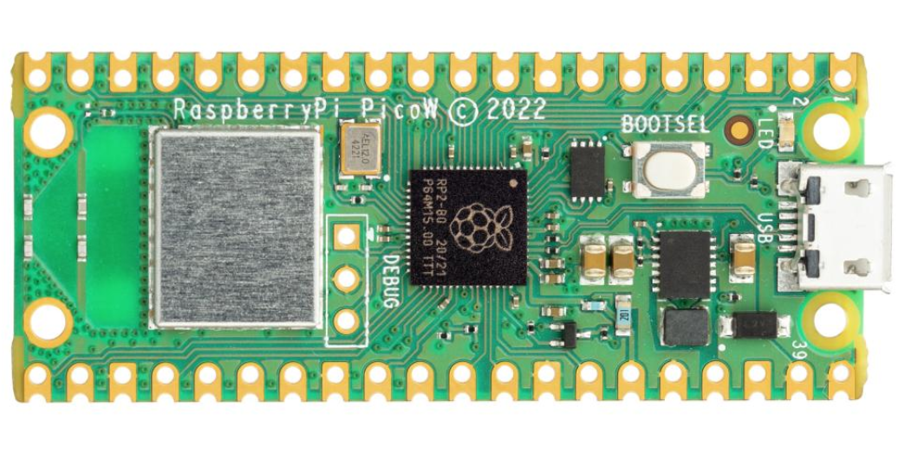 | Raspberry Pi Pico W | Main microcontroller with WiFi capability | Electrokit | ~89 SEK or ~99 SEK (for Pico WH - pre-soldered version) |
| 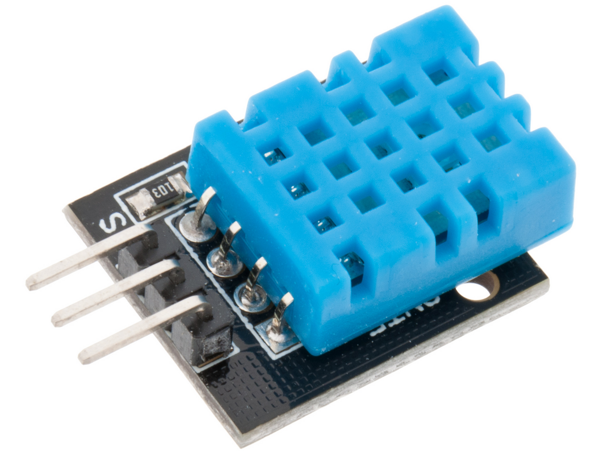 | DHT11 Sensor | Temperature and humidity measurement | Electrokit | ~49 SEK |
| 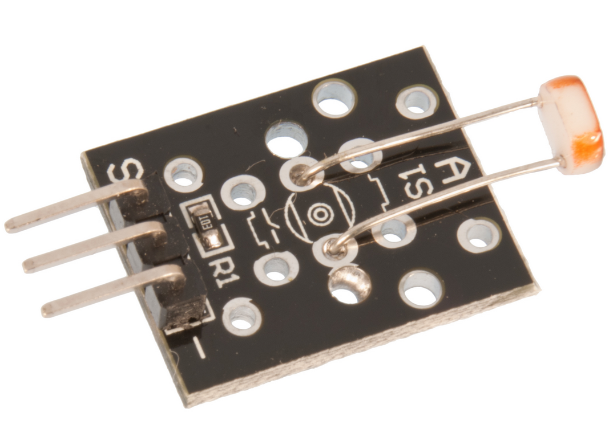 | Photoresistor | Light level detection for sleep environment | Electrokit | ~39 SEK |
| 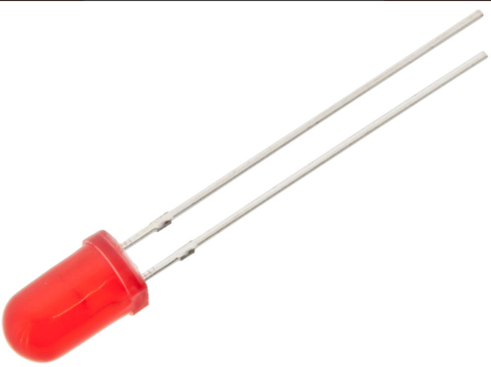 | LED Lights (Red, Green, Yellow) | Visual indicators for environmental conditions | Electrokit | 5 SEK a piece |
| 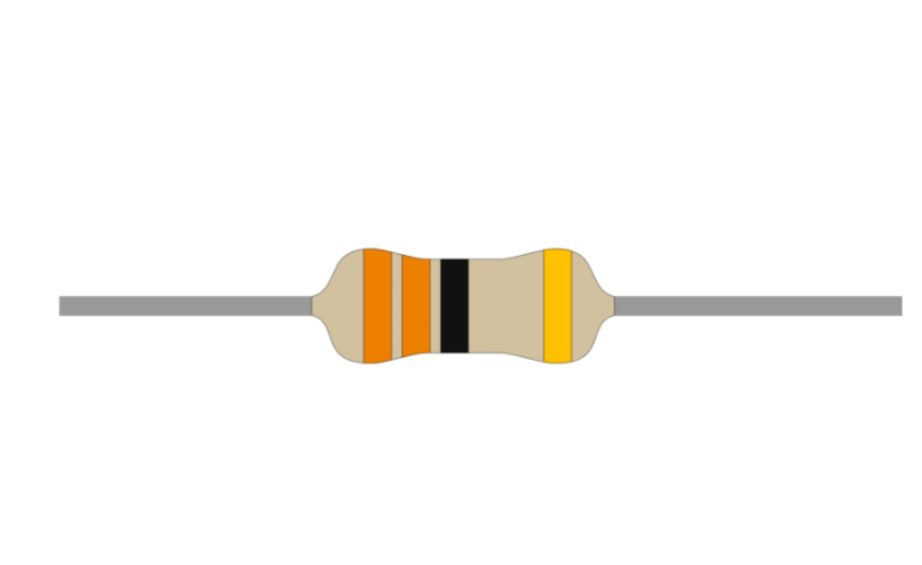 | Resistors (33Ω) | Current limiting for LED lights | Electrokit | ~2 SEK a piece |
| 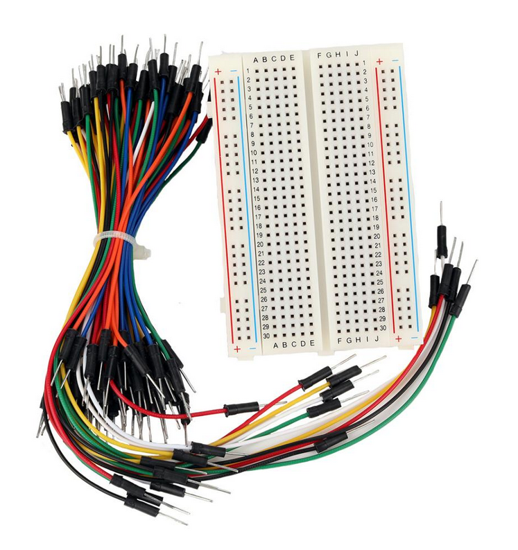 | Breadboard with jumper Wires | Connections between components | Electrokit | ~88 SEK |
| 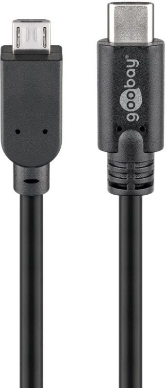 | Micro USB cable | For connecting the Pico W to your computer and power | Electrokit | ~69 SEK |
| 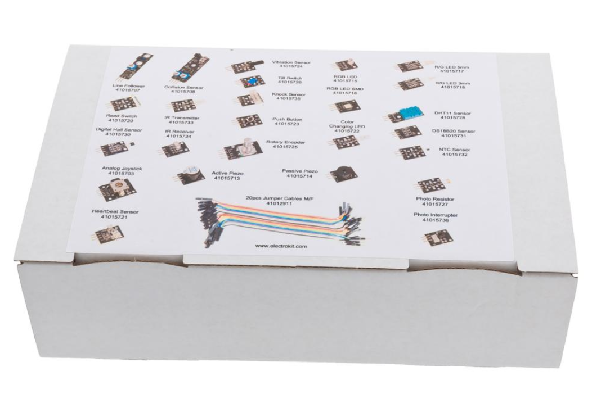 | 24 Sensor Kit (optional) | 24 sensors and components with jumper wires included | Electrokit | ~299 SEK |

### Assembly Photos

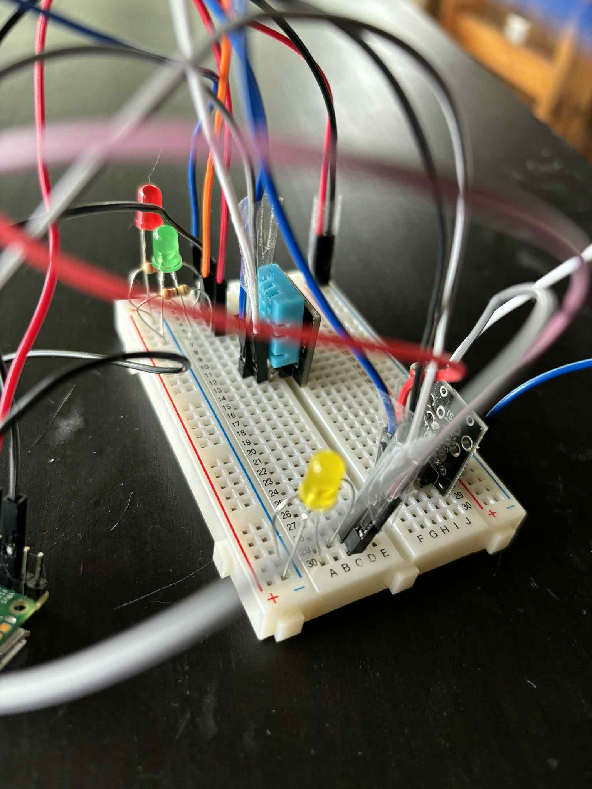
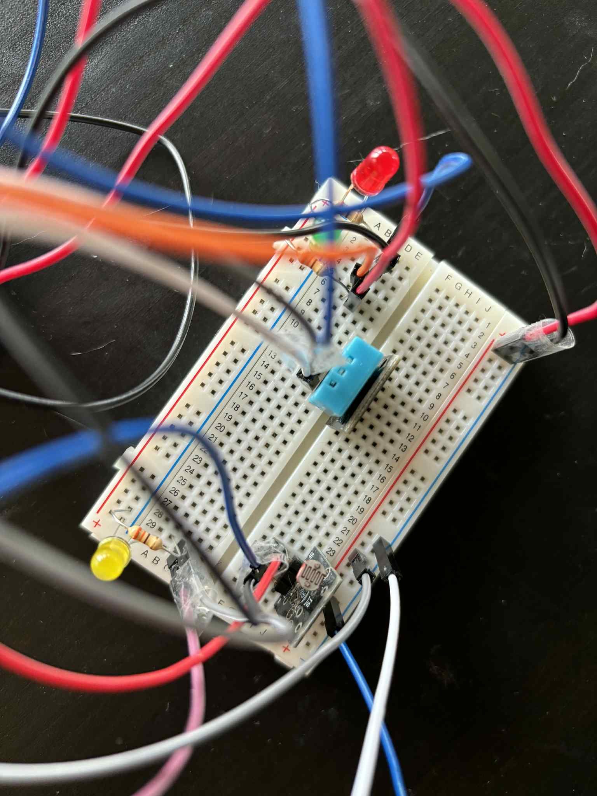
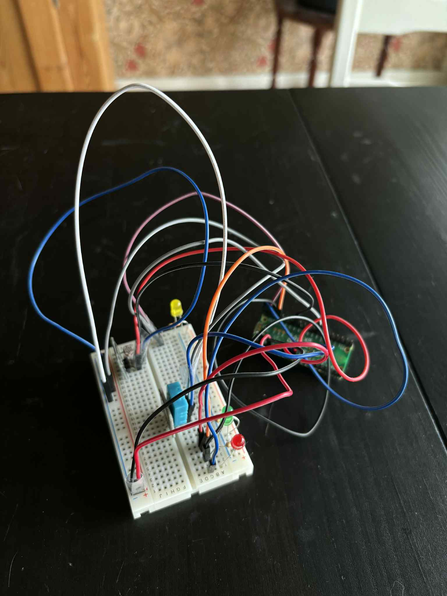

*Hardware setup with breadboard and connections*

#### Connections

DHT11 Sensor:

The DHT11 sensor is a digital temperature and humidity sensor that provides readings for both temperature and humidity. It has a built-in 1kΩ pull-up resistor, so it can be connected directly to the Pico W without an additional resistor. It has the following specifications:

Operating Voltage 3.3V to 5.5V
Humidity range 20% to 90% RH
Humidity accuracy ±5% RH
Humidity resolution 1% RH
Temperature range 0ºC to 50ºC [32ºF to 122ºF]
Temperature accuracy ±2ºC
Temperature resolution 1ºC
Signal transmission range 20m

- Data pin to GPIO 27 on Pico W, powered by 3.3V and connected to GND.

Photoresistor:

The photo resistor has a built-in 10kΩ resistor, so it can be connected directly to the Pico W without an additional resistor. The resistance will increase with less light and decrease with more light, allowing the Pico W to measure the light level.

- Data pin to GPIO 26 on Pico W, powered by 3.3V and connected to GND.

Red LED:

- Anode (longer leg) to GPIO 0 on Pico W (with a 33Ω resistor connected to GND)

Green LED:

- Anode (longer leg) to GPIO 2 on Pico W (with a 33Ω resistor connected to GND)

Yellow LED:

- Anode (longer leg) to GPIO 1 on Pico W (with a 33Ω resistor connected to GND)

#### Circuit Diagram

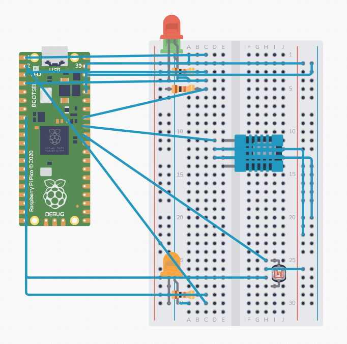

*Circuit diagram showing connections between Raspberry Pi Pico W, DHT11 sensor, photoresistor, LEDs and resistors*

CAUTION! The circuit diagram is a simplified representation of the connections and since Circuit Canvas - the software used to create the diagram - didn't include all the components I used in the project, some connections may not be accurately shown. The DHT11 sensor used in this project has 3 connections VCC, GND and Data, not 4 (so follow the jumper wire connections on the diagram and ignore the 4th, unused pin). The same applies for the photoresistor. Ensure that you follow the correct pin assignments for the Raspberry Pi Pico W and the sensors used in this project. Double-check the connections before powering up the circuit to avoid any damage to the components. (Check the offical sensor documentation to ensure correct wiring and connections since the components may differ).

### The Code

**GitHub Repository:** [IoT Sleep Monitor](https://github.com/SabrinaPL/IoT-sleep-monitor)

Code examples:

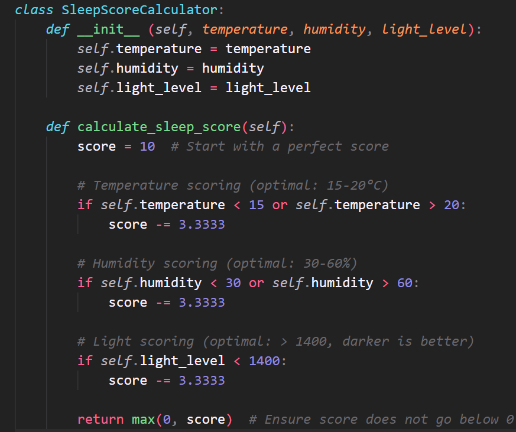

*Sleep score calculation algorithm*

The sleep score is calculated using a simple algorithm that takes into account the temperature, humidity and light levels. The score is based on the following criteria:

- Temperature: Ideal range is between 15-20°C
- Humidity: Ideal range is between 30-60%
- Light Level: Dark threshold is set to 1400

Since there are currently 3 different measurements being taken, the sleep score is calculated based on the average of these three measurements. The sleep score is then sent to Adafruit IO for visualization and analysis.

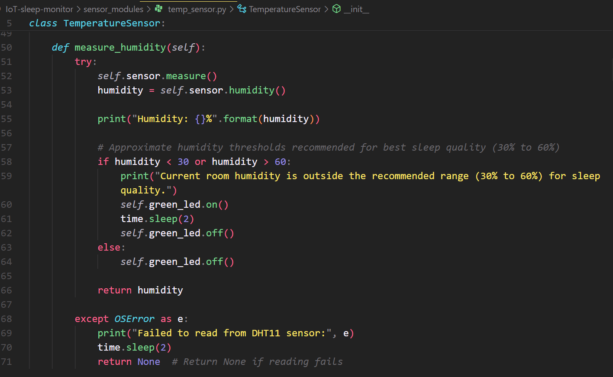

*Function to measure humidity level using DHT11 sensor*

The code is separated into different modules for better organization and maintainability. In the TemperatureSensor class the following function is used to measure and analyze the humidity level using the DHT11 sensor. When the humidity level is outside the ideal range, a green LED will start blinking to indicate that the humidity level is too high or too low.
(The same logic applies to the temperature and light level measurements, where a red LED will blink if the temperature or light level is outside the ideal range for sleep quality and the yellow LED will blink if the room is too bright).

## Platform

**Platform used:** Adafruit IO (cloud-based IoT platform, free-tier)

Comparison to TIG-stack and reason for choice:

Adafruit IO is a cloud-based platform that provides an easy way to visualize and analyze data from IoT devices. It offers features such as data logging, visualization, and webhook integration, making it suitable for projects like the sleep environment monitor. The TIG-stack (Telegraf, InfluxDB, Grafana) is another option for data collection and visualization but requires more setup and configuration. For this project, Adafruit IO is chosen for its simplicity and ease of use. I also wanted to keep the project accessible for those who may not have extensive experience with setting up and managing databases or server infrastructure and explore a new platform for personal learning, since I have previously used the TIG-stack for another project.

For scaling up the project, I would consider using the TIG-stack for more advanced data analysis and visualization capabilities. The TIG-stack allows for more flexibility in data handling and can be integrated with various data sources, making it suitable for larger-scale IoT projects. An alternative to the TIG-stack could be using a cloud service like AWS IoT or Azure IoT, which provides similar capabilities with additional features such as machine learning integration and advanced analytics.

Adafruit IO's largest pro, from my experience in this project, is its simplicity whereas the largest con is its limited customization options. An example of this limitation that I encountered was when I wanted to set up a webhook to trigger an alert when the light level, temperature or humidity exceeded a certain threshold but only trigger the alert once per hour. Adafruit IO doesn't support this kind of conditional logic directly, so I switched off these alerts (since for the time being our bedroom temperature is always above the recommended threshold) and instead kept a more general, once per hour, notification for the temperature, humidity, light level and sleep score. This way I can still monitor the conditions without being overwhelmed by alerts.

## Transmitting the data / Connectivity

The data is transmitted from the Raspberry Pi Pico W to Adafruit IO using the MQTT protocol. The Pico W connects to the home WiFi network (which is well within range of the bedroom, which means that WiFi is sufficient for reliable connectivity) and publishes the sensor readings to the Adafruit IO feed. The webhook integration allows for automated notifications to be sent to a Discord channel with the current sensor readings and sleep score. The data is sent to Adafruit IO for visualization once every 10 seconds, but the webhook notifications are sent once per hour to keep the Discord channel clean and avoid spamming with too many messages.

## Presenting the data

### Data Visualization with Adafruit IO

**Live Dashboard:** [Sleep Environment Monitoring Dashboard](https://io.adafruit.com/sarabrina/dashboards/sleep-environment-monitoring)

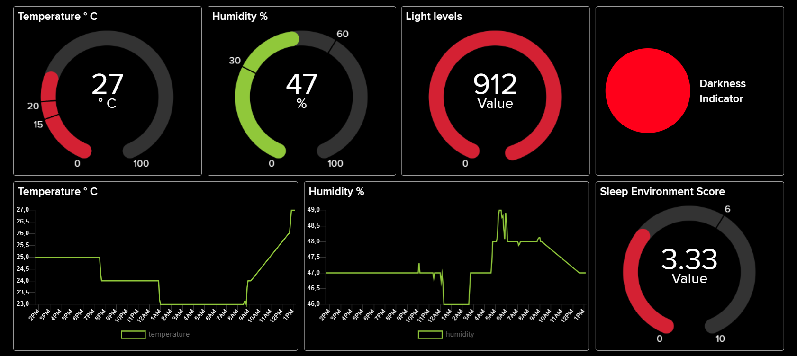
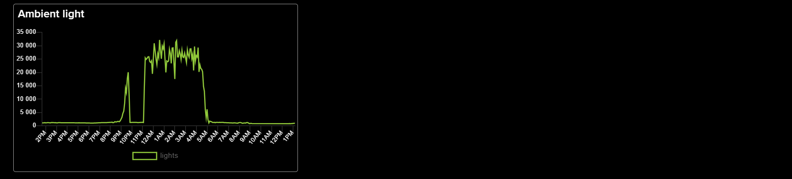

*Adafruit IO dashboard showing real-time sensor data and sleep environment score*

Data is stored 30 days in Adafruit IO (free-tier), allowing for historical analysis and trend monitoring.

### Discord Webhook for Notifications

Discord webhook is used to send notifications from Adafruit IO to a Discord channel once per hour:

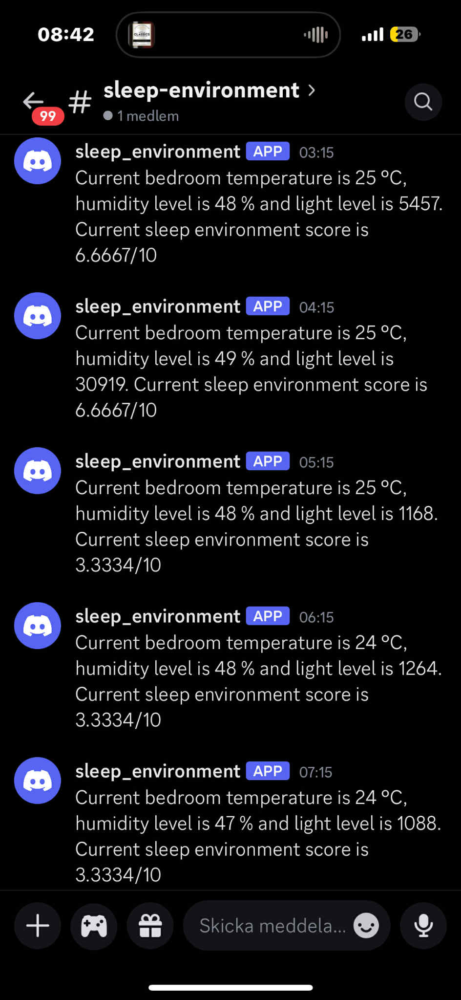

*Automated notifications are sent from Adafruit IO via Discord webhook once per hour with current sensor readings and sleep score*

## Finalizing the Design

*Sleep environment monitor signaling, with the red and yellow LEDs, that current room temperature and light levels are suboptimal and might negatively affect sleep quality whereas current humidity levels (green LED not signaling) are within the threshold for good sleep quality*

### Final thoughts

This project has been a great learning experience and it has been very fun to work with hardware components and IoT platforms, integrating hardware with software to create a functional sleep environment monitor. I've also gained insight into how the temperature (which is currently always above the recommended threshold) in our bedroom might be negatively affecting sleep quality. This project has the potential to be expanded further, for example by adding more sensors to monitor additional environmental factors such as air quality or noise levels, or by integrating machine learning algorithms to analyze the data and provide personalized recommendations for improving sleep quality. I did attempt to add a vibration sensor (to monitor movements during sleep) and also a heart rate sensor included in the sensor kit, but I wasn't able to fine tune the sensors enough to get reliable readings (said sensors also had a recommendation of 5V power whereas the Pico W only provides 3.3V) so I decided to focus on the core components for this project. I also ordered and intented to implement a noise sensor (Sparkfun - SEN-12642), but unfortunately it required soldering which I didn't have the tools for and wasn't prepared for, so I decided to leave it out of this project for now.

### Future improvements

- Add more sensors to monitor additional environmental factors such as movement during sleep, heart rate and noise levels which might affect sleep quality and give more insights to sleep environemnt and sleep patterns.
- Migrate the project to a different, more advanced stack - such as Azure IoT or TIG-stack - for more advanced data analysis and visualization capabilities.
- Setup a backend and integrate machine learning algorithms to analyze the data and provide personalized recommendations for improving sleep quality.
- Implement a more advanced alert system that can trigger notifications based on specific conditions (e.g., temperature or humidity exceeding a certain threshold) and send alerts only once per hour to avoid spamming the Discord channel.
